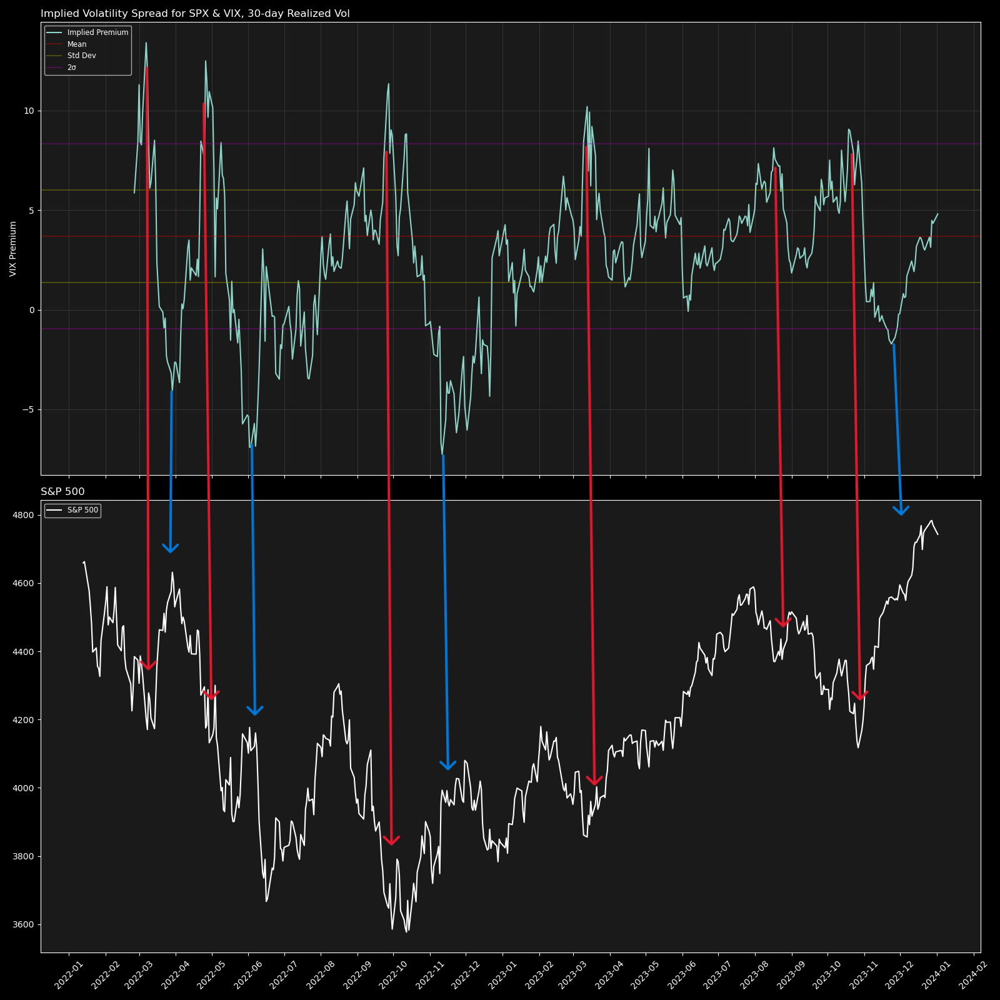
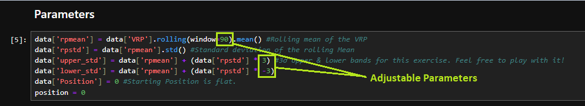

## Small Backtest Exercise

Preston Fisk

prestonfisk99@gmail.com

github.com/prestonf99

## Overview

This was a small exercise because upon building our Volatility Risk Premium models, we thought that the models passed an "eye test". In the image below, you'll see that during many major turning points in the market the volatility risk premium/discount was at extreme levels. We set out to determine whether or not you could generate signals based off of the volatility dynamics. In this notebook, we import our data, restructured the data with relevant information (Volatility risk premium, returns, etc.), calculated 90d rolling mean of the VRP & a 3σ as our entry threshold (These can be adjusted by the user!), implemented some position logic, and created some tools for evaluating performance. 

### The 'Eye Test' Mentioned Above

As seen below, during many of the major turning points in the market in the sample period (January 2022-April 2024), the volatility risk premium & discount were at extreme levels. The real challenge here is defining what "extreme" is to generate trading signals.  

    
## Setting it Up

*Directions are for windows, chatgpt can be your friend here if on mac*

1. First, you'll need to install miniconda on your computer 
        
        https://docs.anaconda.com/free/miniconda/index.html

2. Open the Anaconda prompt (windows search 'miniconda') and install the packages (at this step you can look up how to create an environment, but if you're only using python to execute these files it really isn't a big deal if you just use the base environment). 

        pip install numpy pandas matplotlib yfinance jupyter datetime

3. After the installations are done, open jupyter lab

        (base): C:\Users\your_computer> jupyter lab

4. Navigate to the folder that contains `backtest_exercise.ipynb` and run the cells by hitting shift+enter.

5. If you'd like to adjust the parameters, scroll down to 'Parameters'. You can adjust the window and the standard deviations. The adjustable parameters are shown below. 

6. Evaluate results at the bottom of the notebook!! 

    